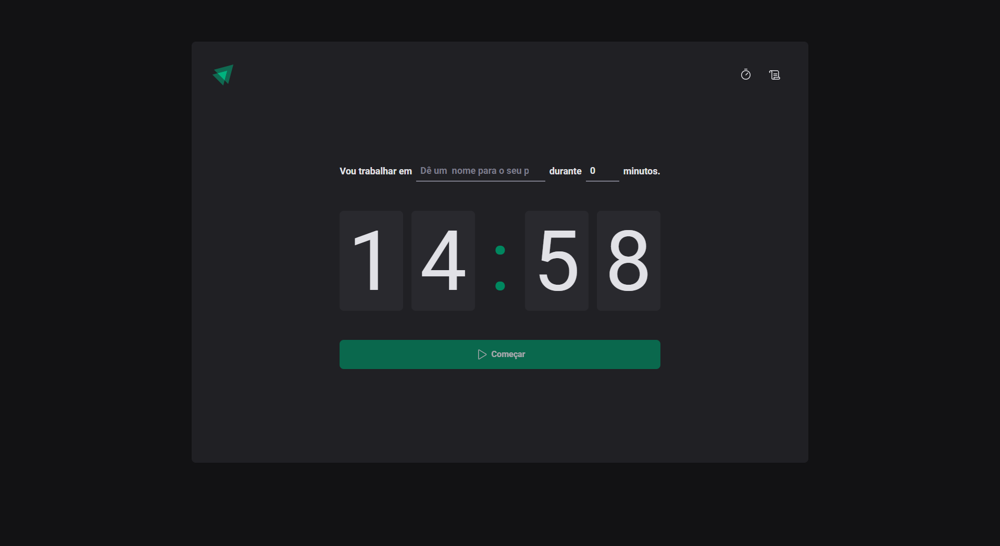

# Projeto Ignite - React JS - Timer

Desenvolvimento de uma página para conhecimentos das seguintes áreas:

- vite
- css modules
- componentes
- stytled-componentes
- typescript
- Prop Drilling -> (Quando a gente tem MUITAS propriedades APENAS para a comunicação entre components)
- context API -> (Permite compartilharmos informações entre vários components ao mesmo tempo, resolvendo o problema de Prop Drilling)
- Context
- Reducers
- Immer
- Dentre muitos outros conhecimentos...

---

## 🚀 Sobre mim
I'm a Javascript Developer, know me in:
- www.tayserosa.dev
- www.github.com/tayserosa
- www.linkedin.com/in/tayse-rosa

## 🔗 Links

